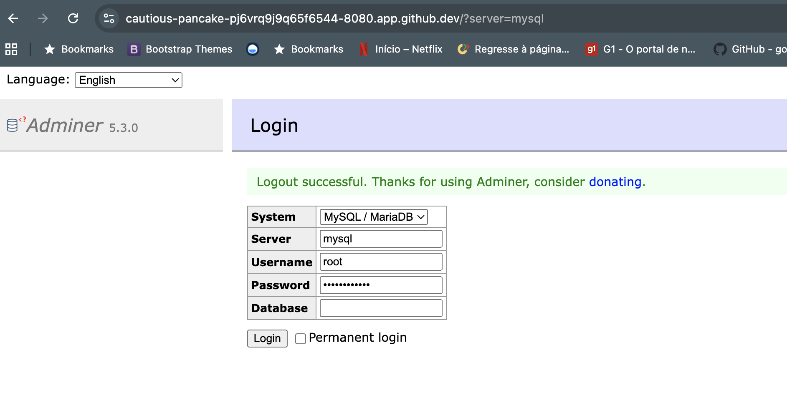
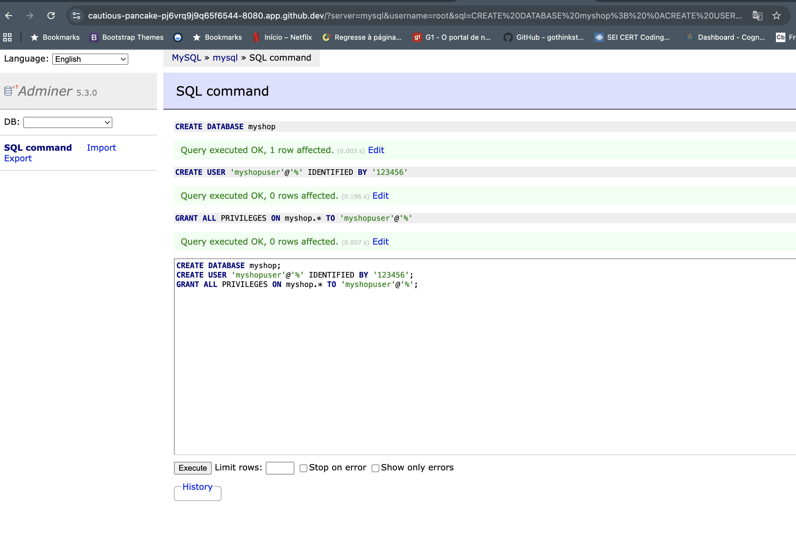
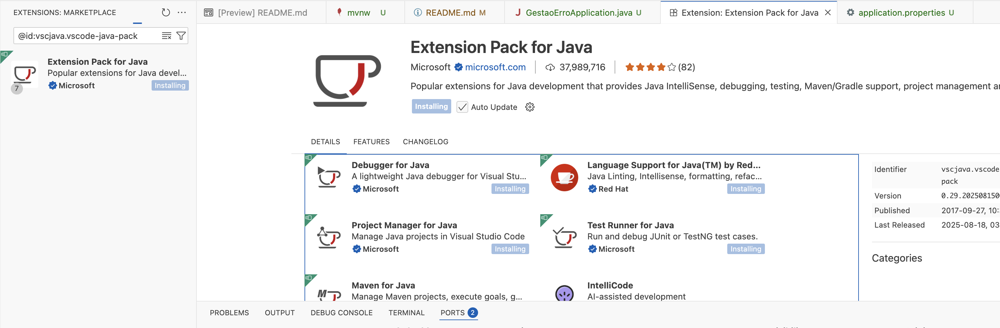

Gestão de Erros com Spring Boot
Esta documentação te guiará através dos passos necessários para rodar a aplicação de exemplo de gestão de erros com Spring Boot utilizando o Codespaces.

Como rodar a aplicação no Codespaces
Siga estes passos para configurar e iniciar a sua aplicação:

Instalar o Java Development Kit (JDK)

No terminal do Codespaces, instale o Java 21 ou superior. Você pode usar um gerenciador de versão como o SDKMAN! para isso.

sdk install java 24-open

Iniciar o banco de dados MySQL

Execute o comando docker-compose up no terminal. Isso irá iniciar um container Docker com o MySQL, essencial para o funcionamento da aplicação.

Configurar a conexão com o banco de dados

Use as seguintes credenciais para se conectar ao MySQL:

Servidor: mysql

Usuário: root

Senha: rootpassword

Dica: A aplicação irá criar as tabelas automaticamente ao ser iniciada.

Executar a aplicação Spring Boot

Certifique-se de que a extensão de Java do Codespaces (Java Extension Pack) está instalada. Ela oferece ferramentas para compilação e execução do projeto.

Você pode iniciar a aplicação através do botão de "Play" na sua IDE (ambiente de desenvolvimento integrado) ou utilizando um comando Maven/Gradle no terminal, como mvn spring-boot:run

Uma vez iniciada, a aplicação estará disponível na porta 8080. O Codespaces fará o port forwarding (redirecionamento de portas) automaticamente.

